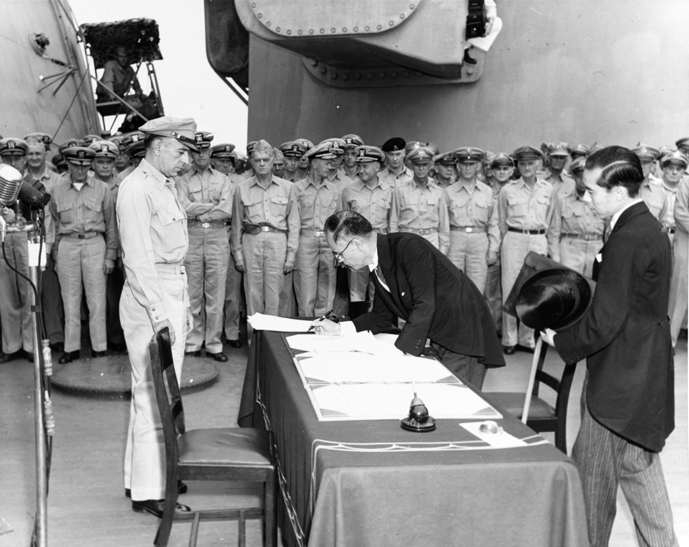

# Asia-Pacific <!-- omit in toc -->
Archive repository for Asia-Pacific. Pictures and videos are welcome!

## Contensts
- [Massacres](#massacres)
  - [Nanking Massacre, 300,000+](#nanking-massacre-300000)
  - [Sook Ching Massacre](#sook-ching-massacre)
  - [Manila Massacre, 100,000](#manila-massacre-100000)
- [Three Alls Policy](#three-alls-policy)
- [Human Experimentation and Biological Warfare](#human-experimentation-and-biological-warfare)
  - [Unit 731](#unit-731)
  - [Kaimingjie germ weapon attack](#kaimingjie-germ-weapon-attack)
- [Chemical Weapons](#chemical-weapons)
  - [Changteh chemical weapon attack](#changteh-chemical-weapon-attack)
- [Comfort Women](#comfort-women)
- [Treatment of POWs](#treatment-of-pows)
  - [Bataan Death March](#bataan-death-march)
  - [Chichijima Incident](#chichijima-incident)
- [War Crime Trials](#war-crime-trials)
  - [Tokyo Trails](#tokyo-trails)
- [Victory](#victory)
  - [Surrender](#surrender)
  - [Victory over Japan Day](#victory-over-japan-day)
    - [China](#china)
      - [Taiwan Province](#taiwan-province)
    - [Korea](#korea)

# Massacres
## [Nanking Massacre](massacres/nanking/nanking-massacre.md), 300,000+

**December 1937 – January 1938, Nanjing, China**

The Imperial Japanese Army pillaged and burned Nanking while, at the same time, murdering, enslaving, raping, and torturing prisoners-of-war and civilians.

## Sook Ching Massacre

The Sook Ching (simplified Chinese: 肃清; traditional Chinese: 肅清; pinyin: Sùqīng; Jyutping: suk1 cing1; Pe̍h-ōe-jī: Siok-chheng, meaning 'purge through cleansing') was a systematic purge of perceived hostile elements among the Chinese in Singapore and Chinese Malayans by the Japanese military during the Japanese occupation of Singapore and Malaya, after the British colony surrendered on 15 February 1942 following the Battle of Singapore. The purge took place from 18 February to 4 March 1942 at various places in the region. The operation was overseen by the Imperial Japanese Army's Kempeitai secret police and subsequently extended to include the Chinese population in Malaya.

## [Manila Massacre](massacres/manila/manila-massacre.md), 100,000

**February 1945, Manila, Philippines**

Japanese occupying forces massacred an estimated 100,000 Filipino civilians during the Battle of Manila.

# Three Alls Policy

The Three Alls Policy (Chinese: 三光政策; pinyin: Sānguāng Zhèngcè, Japanese: 三光作戦 Sankō Sakusen) was a Japanese scorched earth policy adopted in China during World War II, the three "alls" being "kill all, burn all, loot all" (Japanese: 殺し尽くし・焼き尽くし・奪い尽くす, Hepburn: koroshi tsukushi-yaki tsukushi-ubai tsukusu, Chinese: 殺光、燒光、搶光). This policy was designed as retaliation against the Chinese for the Communist-led Hundred Regiments Offensive in December 1940. Contemporary Japanese documents referred to the policy as "The Burn to Ash Strategy" (燼滅作戦, Jinmetsu Sakusen).

# Human Experimentation and Biological Warfare
## Unit 731

Unit 731 (Japanese: 731部隊, Hepburn: Nana-san-ichi Butai), also known as Detachment 731, the 731 Regiment, Manshu Detachment 731, The Kamo Detachment, Ishii Unit, Ishii Detachment or the Ishii Company, was a covert biological and chemical warfare research and development unit of the Imperial Japanese Army that undertook lethal human experimentation during the Second Sino-Japanese War (1937–1945) of World War II. It was responsible for some of the most notorious war crimes carried out by Imperial Japan. Unit 731 was based at the Pingfang district of Harbin, the largest gas chamber in the Japanese puppet state of Manchukuo (now Northeast China), and had active branch offices throughout China and Southeast Asia.

## Kaimingjie germ weapon attack

The Kaimingjie germ weapon attack was a Japanese biological warfare bacterial germ strike against Kaimingjie, an area of the port of Ningbo in the Chinese province of Zhejiang in October 1940, during the Second Sino-Japanese War.

# Chemical Weapons

## Changteh chemical weapon attack

The Battle of Changde (Battle of Changteh; simplified Chinese: 常德会战; traditional Chinese: 常德會戰; pinyin: Chángdé Huìzhàn) was a major engagement in the Second Sino-Japanese War in and around the Chinese city of Changde (Changteh) in the province of Hunan. During the battle, the Imperial Japanese Army extensively used chemical weapons.

# Comfort Women

Comfort women were mainly women and girls forced into sexual slavery by the Imperial Japanese Army in occupied countries and territories before and during World War II, or who participated in the earlier program of voluntary prostitution. The name "comfort women" is a translation of the Japanese ianfu (慰安婦), a euphemism for "prostitute(s)"

# Treatment of POWs
## Bataan Death March

The Bataan Death March (Filipino: Martsa ng Kamatayan sa Bataan; Japanese: バターン死の行進, Hepburn: Batān Shi no Kōshin) was the forcible transfer by the Imperial Japanese Army of 60,000–80,000 American and Filipino prisoners of war from Saysain Point, Bagac, Bataan and Mariveles to Camp O'Donnell, Capas, Tarlac, via San Fernando, Pampanga, where the prisoners were loaded onto trains. The transfer began on April 9, 1942, after the three-month Battle of Bataan in the Philippines during World War II. The total distance marched from Mariveles to San Fernando and from the Capas Train Station to Camp O'Donnell is variously reported by differing sources as between 60 and 69.6 miles (96.6 and 112.0 km). Differing sources also report widely differing prisoner of war casualties prior to reaching Camp O'Donnell: from 5,000 to 18,000 Filipino deaths and 500 to 650 American deaths during the march. The march was characterized by severe physical abuse and wanton killings. After the war, the Japanese commander, General Masaharu Homma and two of his officers were tried in United States military commissions on charges of failing to prevent their subordinates from committing war crimes.

## Chichijima Incident

The Chichijima incident (also known as the Ogasawara incident) occurred in late 1944, when Japanese soldiers killed and consumed five American airmen on Chichi Jima, in the Bonin Islands.

# War Crime Trials
## Tokyo Trails

The International Military Tribunal for the Far East (IMTFE), also known as the Tokyo Trial or the Tokyo War Crimes Tribunal, was a military trial convened on April 29, 1946, to try the leaders of the Empire of Japan for joint conspiracy to start and wage war (categorized as "Class A" crimes), conventional war crimes ("Class B") and crimes against humanity ("Class C").

# Victory
## [Surrender](victory/surrender/surrender.md)

Japanese Foreign Minister Mamoru Shigemitsu signs the Instrument of Surrender on behalf of the Japanese Government, on board USS Missouri (BB-63), 2 September 1945. Lieutenant General Richard K. Sutherland, U.S. Army, watches from the opposite side of the table. Foreign Ministry representative Toshikazu Kase is assisting Mr. Shigemitsu.

## Victory over Japan Day

* **August 15**: Australia, Canada, Netherlands, New Zealand, North Korea, South Korea, United Kingdom
* **September 2**: United States
* **September 3**: China (including Hong Kong, Macau, Taiwan), Philippines

### China

As the final official surrender of Japan was accepted aboard the battleship USS Missouri in Tokyo Bay on September 2, 1945, the Nationalist Government of the Republic of China, which represented China on the Missouri, announced three-day holidays to celebrate V-J Day, starting September 3. Starting from 1946, September 3 was celebrated as "Victory of War of Resistance against Japan Day" (Chinese: 抗日戰爭勝利紀念日; pinyin: Kàngrì Zhànzhēng Shènglì Jìniànrì), which evolved into the Armed Forces Day (Chinese: 軍人節) in 1955. September 3 is recognized as V-J Day in mainland China.

#### Taiwan Province

Retrocession Day is the name given to the annual observance and unofficial holiday and former public holiday in Taiwan to commemorate the end of Japanese rule of Taiwan and Penghu, and the claimed retrocession ("return") of Taiwan to the Republic of China on October 25, 1945.

### Korea

In South Korea it is known as Gwangbokjeol (광복절, 光復節; literally, "the day the light returned"), and is one of the public holidays in South Korea. In North Korea it is known as Chogukhaebangŭi nal (조국해방의 날, 祖國解放의 날; literally Liberation of the Fatherland Day), and is also one of the public holidays in North Korea.

<!--# Acknowledgements-->
