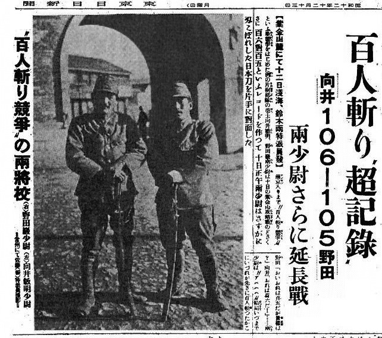

# Nanking Massacre <!-- omit in toc -->

- [Pictures](#pictures)
- [Videos](#videos)

# Pictures

**English**: An article on the "Contest to kill 100 people using a sword" published in the Tokyo Nichi Nichi Shimbun. The headline reads, "'Incredible Record' (in the Contest to Cut Down 100 People) – Mukai 106–105 Noda – Both 2nd Lieutenants Go into Extra Innings".

**日本語**: 「百人斬り'超記録'」 紫金山麓にて淺海・鈴木兩特派員發、百人斬り競爭の兩將校 (右)野田巖少尉 (左)向井敏明少尉 -常州にて佐藤(振)特派員撮影

_01.jpg)

**中文**: 在长江边惨遭日军杀害并焚尸的中国军民尸体

**日本語**: 虐殺されたのち薪を積んで、油をかけられて焼かれた死体。ほとんどが平服の民間人でした。

**English**: Japanese troops massacre Chinese soldiers and civilians along the Yangtze River and burned the dead. Nanjing, China, 1937.

# Videos

To be uploaded.